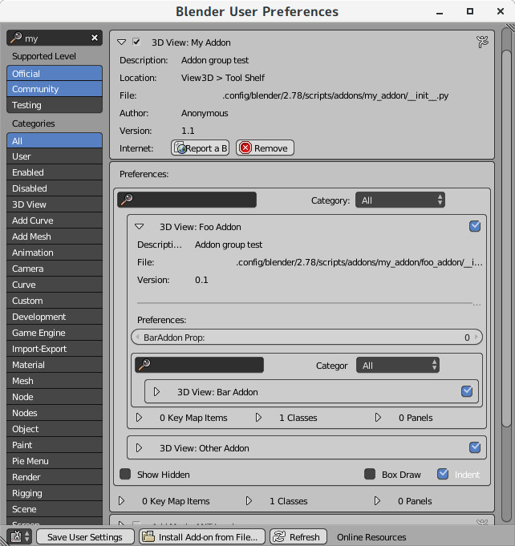

# アドオンの階層化

モジュール`addongroup.py`を用いて、アドオン内にある別のアドオンを認識させる。



```
例:
2.78/scripts/addons/base_addon/ --- __init__.py
                                 |- addongroup.py
                                 |
                                 |- my_addon/ --- __init__.py
                                 |             |- addongroup.py
                                 |             |
                                 |             `- child_addon/ --- __init__.py
                                 |                              `- addongroup.py
                                 |
                                 `- space_view3d_other_addon.py
```

## アドオンの修正

AddonPreferencesを持たず、かつ子を追加する予定の無いアドオンなら修正の必要は無い。  
単体ファイルからなるアドオンならパッケージに変更し、中に`addongroup.py`をコピーしておく。  

import部分

```
if 'bpy' in locals():  # F8キーでモジュールが再読み込みされる場合。
    import importlib
    importlib.reload(addongroup)
    MyAddonPreferences.reload_sub_modules()  # 子のアドオンを再読み込みする。
else:
    from . import addongroup

import bpy
```

AddonPreferencesの修正

```
# 子となるアドオンは bpy.types.AddonPreferences ではなく
# bpy.types.PropertyGroup を継承する必要がある
class MyAddonPreferences(
        addongroup.AddonGroupPreferences,
        bpy.types.AddonPreferences if '.' not in __name__ else
        bpy.types.PropertyGroup):

    bl_idname = __name__
    
    # 子となるアドオンを文字列のリストで指定する。デフォルトは空のリスト。
    # Noneなら現在のアドオンのディレクトリの中からアドオンを自動で検索する。
    sub_modules = None

    # 元からdrawメソッドが存在するならAddonGroupPreferencesのdraw関数も呼んでおく
    def draw(self, context):
        # (略)
        super().draw(context)

    # 元からregisterメソッドが存在するならAddonGroupPreferencesの(ry
    @classmethod
    def register(cls):
        # (略)
        super().register()

    # 元からunregisterメソッドが(ry
    @classmethod
    def unregister(cls):
        # (略)
        super().unregister()
```

register関数の修正

`register_addon`クラスメソッドで`register`関数をデコレートする

```
classes = [
    ...
]

@MyAddonPreferences.register_addon
def register():
    for cls in classes:
        bpy.utils.register_class(cls)
    
    # bpy.utils.register_classではなく、bpy.utils.register_moduleを使っているなら
    # 代わりにregister_moduleメソッドを使う。
    # MyAddonPreferences.register_module()
    #
    # AddonPreferencesが無い場合はaddongroup.register_module関数を使う。
    # addongroup.register_module(__name__)
```

unregister関数の修正

```
def unregister():
    for cls in classes[::-1]:
        bpy.utils.unregister_class(cls)
    
    # bpy.utils.unregister_classではなく、bpy.utils.unregister_moduleを使っているなら
    # 代わりにunregister_moduleメソッドを使う。
    # MyAddonPreferences.unregister_module()
    #
    # AddonPreferencesが無い場合はaddongroup.unregister_module関数を使う。
    # addongroup.unregister_module(__name__)
```

AddonPreferencesインスタンスの取得方法

```
# 子のアドオンではこの方法は不可となる。
addon_prefs = bpy.context.user_preferences.addons[MyAddonPreferences.bl_idname].preferences

# 代わりにクラスメソッドのget_instanceで取得する。
# 子の場合、このインスタンスの型はAddonPreferencesではなくPropertyGroupとなる点には注意。
addon_prefs = MyAddonPreferences.get_instance()
```

他

```
addon_prefs = MyAddonPreferences.get_instance()

# UserPreferences画面で詳細が表示されているかはshow_expanded_+モジュール名の属性。
show_child_addon_detail = addon_prefs.show_expanded_child_addon

# アドオンが有効か否かは use_ + モジュール名。
if addon_prefs.use_child_addon:
    # 子のアドオン設定はモジュール名の属性からでも取得できる。
    child_addon_prefs = addon_prefs.child_addon
```

## 親となるアドオンの作成

既存のアドオンに子を追加してもいいけど、今回は無機能のアドオンを作ってそれに子を追加する。

```
# base_addon/__init__.py

bl_info = {
    'name': 'Base Addon',
    'author': 'Anonymous',
    'version': (1, 0),
    'blender': (2, 78, 0),
    'location': 'View3D > Tool Shelf',
    'description': 'Addon group test',
    'warning': '',
    'wiki_url': '',
    'category': '3D View',
    }

if 'bpy' in locals():
    import importlib
    importlib.reload(addongroup)
    BaseAddonPreferences.reload_sub_modules()
else:
    from . import addongroup

import bpy

class BaseAddonPreferences(
        addongroup.AddonGroupPreferences, bpy.types.AddonPreferences):

    bl_idname = __name__

    # モジュール名が _ で始まっているなら初期状態では設定画面に表示されない。
    # Show Hidden のチェックボックスを有効にすると表示される。
    sub_modules = [
        'my_addon',
        'space_view3d_other_addon'
    ]

classes = [
    BaseAddonPreferences,
]

@BaseAddonPreferences.register_addon
def register():
    for cls in classes:
        bpy.utils.register_class(cls)

def unregister():
    for cls in classes[::-1]:
        bpy.utils.unregister_class(cls)
```

## registerinfo.AddonRegisterInfoとの連携

```
class MyAddonPreferences(
        addongroup.AddonGroupPreferences,
        registerinfo.AddonRegisterInfo,
        bpy.types.AddonPreferences if '.' not in __name__ else
        bpy.types.PropertyGroup):
    ...

@MyAddonPreferences.register_addon
def register():
    MyAddonPreferences.register_module()

    # KeyMap を取得するには get_keymap メソッドを使う。
    # これは bpy.context.window_manager.keyconfigs.addon.keymaps から取得している。
    km = MyAddonPreferences.get_keymap('3D View')
    """:type: bpy.types.KeyMap"""
    if km:
        kmi = km.keymap_items.new('view3d.numpad', 'A', 'PRESS')
    ...

@MyAddonPreferences.unregister_addon
def unregister():
    # AddonRegisterInfo の register_addon と unregister_addon で関数をラップした場合、
    # register 関数内で追加した KeyMapItem の削除は自動で行ってくれる。

    MyAddonPreferences.unregister_module()
```