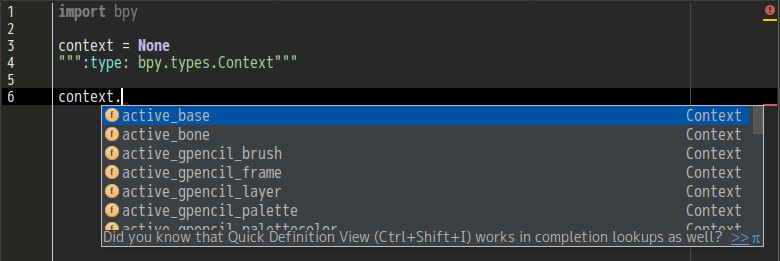

# blender fake python module


pycharmでの使用を前提としたコード補完用の擬似pythonモジュール。  
blender-2.77aのものをbpymodules277aとして同梱しているが、py_module_gen.pyで自分の環境に合ったものを生成出来る。




## py_module_gen.pyの使い方

* py_module_gen.pyとbgl_functions.pyは同一ディレクトリに置く

* Sphinxをインストールする <http://sphinx-doc.org/index.html>  
  pipを使ってインストールなら以下のコマンド

  ```
  # pip3 install sphinx
  ```

* blenderのソースを取得する

  ```
  % git clone http://git.blender.org/blender.git
  % cd blender
  % git submodule update --init --recursive
  % git submodule foreach git checkout master
  % git submodule foreach git pull --rebase origin master
  ```

* ソースのバージョンをblenderの実行ファイルのものに合わせる  
  例) 2.77aの場合

  ```
  % git checkout v2.77a
  ```

* rstファイルの生成

  ```
  % cd doc/python_api
  % blender --background -noaudio --python sphinx_doc_gen.py
  ```

* rst -> xml  

  ```
  % sphinx-build -b xml sphinx-in sphinx-out
  ```

* xml -> py  
  --outputで指定したディレクトリの下にbpy,bgl,mathutils等のpythonモジュールが生成される

  ```
  % blender --background -noaudio --python py_module_gen.py -- --input ./sphinx-out --output ./bpymodules
  ```

* pycharmでの設定  
  File -> Settings... -> Project -> Project Structure -> +Add Content Root を押して先程作ったディレクトリ(任意の場所に移動しておく)を指定する  
  

License: GPL version 2 or any later version
